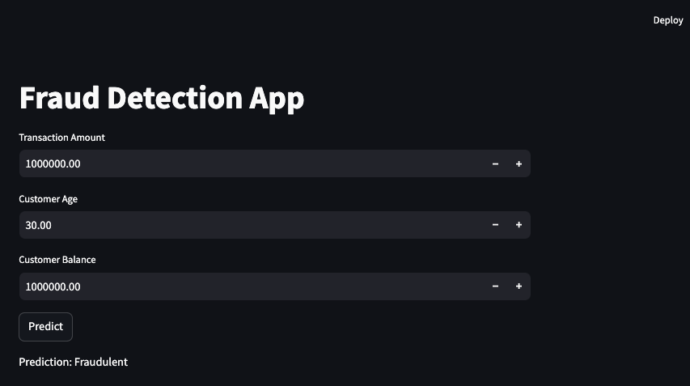

# 0. App version log


| Version | Description                                                                                                                                                                                                                                                                                                                                                                                                                                                                                                                                     |
| ------- | :---------------------------------------------------------------------------------------------------------------------------------------------------------------------------------------------------------------------------------------------------------------------------------------------------------------------------------------------------------------------------------------------------------------------------------------------------------------------------------------------------------------------------------------------- |
| v1      | Initial release. Basic functionality implemented.                                                                                                                                                                                                                                                                                                                                                                                                                                                                                               |
| v2      | Upgrading Streamlit application by adding interactive visualizations.<br>Including a feature importance graph to help users understand which features are most influential in predicting fraud.<br>Implementing real-time confidence intervals to display the model's prediction uncertainty. <br>Integrating SHAP (SHapley Additive exPlanations) into the application to provide explanations for each prediction. <br>Displaying SHAP values for individual transactions so that users can see which features contributed to the prediction. |
| v3      | Modified FastAPI application to handle real-time data streams.<br>Implemented a feature that allows the model to continuously score incoming transactions from a simulated real-time data source (csv in target                                                                                                                                                                                                                                                                                                                                 |

# 1. Running the app

## Please note:**

Running this application in the Google Colab environment can be challenging. For this exercise, I **highly recommend** using Python locally installed (either Jupyter Notebook or via a IDE such as PyCharm). Setting up Jupyter locally via Python/Anaconda (as outlined in the pre-course resources) is much more straightforward than configuring tunnels or other workarounds to run apps in Colab.

#### If You Prefer Google Colab

If you still wish to proceed with Google Colab, here are some resources that might be helpful (please note that I have not personally tested or validated these methods and it might take a long time to set up!):

- [Running FastAPI and Streamlit on Google Colab - Medium Article 1](https://stephencowchau.medium.com/using-google-colab-a-bit-more-with-fastapi-and-streamlit-23988cde0f18)
- [How to Run Streamlit Apps from Colab - Medium Article 2](https://medium.com/@jcharistech/how-to-run-streamlit-apps-from-colab-29b969a1bdfc)

## 1.1 Manual scoring of individual transactions

To start the app, run the following commands **in 2 different terminal windows**

terminal window 1: `uvicorn dsif11app-fraud:app --reload --port 8502`
terminal window 2: `streamlit run dsif11app-fraud-streamlit.py`

This will load up the app below:



---

## 1.2 Real time scoring (app-v3 only)

To join the battle to fraud, simply follow the following steps:

- cd fraud-detector/bin
- source run_stream_scoring.sh

```
app-v3
└───bin
|   │  run_stream_scoring.sh:       Streaming applications which scans for incoming transactions from a target folder, 
|   │                               and generates predictions based on specified model based on a api.
```

# 2. Assignment Instructions

## **Exercise 2.1**: Adding a File Upload Section and Saving Predictions in CSV (**5 points**)

In this exercise, you will extend your Streamlit app by allowing users to upload a file with new transactions, get the fraud predictions back, and save the results as a CSV file. Follow the instructions below to complete the task.

### **Step-by-Step Instructions:**

a. **File Upload Section**:

* Add a section where users can upload a CSV file containing new transactions.
* The file should include columns such as `transaction_amount`, `transaction_time`, `customer_age`, `customer_balance`.
  b. **Process the File**:
* Once the file is uploaded, read it into a pandas DataFrame.
  c. **Run Predictions**:
* After the file is uploaded, run predictions using your pre-trained model for all transactions in the file. You can do this by either calling the `predict/` HTTP method we built previously (defined in  `dsif11app-fraud.py`) for each individual transaction and process it one at the time, or by creating an additional HTTP method that does the batch scoring (similar to what we implemented in the `predict_automation/` method).
  d. **Save Predictions**:
* Allow users to download the results (with fraud predictions) as a CSV file.
* Include an option to choose the location where the file will be saved.

## **Exercise 2.2**:   Adding Visuals to Streamlit App (5 points)

In this exercise, you will enhance your Streamlit app by incorporating an interactive scatter plot feature. This will allow users to select which numerical columns from the dataset to display against each other for deeper insights. You will also create an additional feature, **transaction amount to balance ratio**, which can be included as a selectable option for visualization.

### **Step-by-Step Instructions:**

a.  **New Feature: Transaction Amount to Balance Ratio**:
-   Create a new feature: **transaction amount to balance ratio**.
-   Include this feature as one of the selectable options for the scatter plot.
b.  **Interactive Scatter Plot**:
-   Add an interactive scatter plot to the app that lets users choose which numerical columns to plot on the x-axis and y-axis from the available dataset columns.

This exercise will give users more flexibility in exploring relationships between different variables and uncovering patterns in transaction data.

# 3 Additional exercises (optional)

If you would like to move further on the 'app building' journey, feel free to use the exercises below as an opportunity to practice something new.

**NOTE:** This will likely require additional reading online and some of the below concepts are definitely more geared towards medium-advanced level Pythonists!

## 3.1 Cloud Deployment and Monitoring

- Deploy your FastAPI application to a cloud platform (e.g., AWS, Azure, Heroku). Set up basic monitoring to log and analyze prediction results over time. Provide a brief report on the application's performance post-deployment.

## 3.2 Bias Analysis and Ethical Implications

- Analyze your model for potential bias, especially regarding customer demographics (i.e. age). Discuss any ethical implications of using your model in a real-world setting and propose strategies to mitigate identified biases if any (e.g. rebalancing the training dataset or adjusting model thresholds).

## 3.3 Security Measures in FastAPI

- Implement at least two security measures in your FastAPI application to protect it from common vulnerabilities. These could include input validation, rate limiting, or basic authentication.

  > e.g.:
  >

  - Add input validation to ensure that only valid data is processed by the API.
  - Implement rate limiting to prevent abuse by limiting the number of requests from a single IP address.

## 3.4 Comprehensive Documentation and Testing

- Write detailed documentation for your FastAPI application, including instructions on deployment, usage, and extending the model. Implement unit and integration tests to ensure your API endpoints and model predictions are functioning correctly.
- **Example:** Create a README file that explains how to set up and deploy the FastAPI app, including example API calls. Write unit tests using a testing framework (e.g., pytest) to validate API behavior.

## 3.5 Building fraud model using more realistic data

In this exercise, you will implement a fraud detection model using autoencoders, leveraging the **Credit Card Fraud Detection** dataset from Kaggle. This dataset contains transactions made by European cardholders in 2013, with a small percentage flagged as fraudulent. Autoencoders are particularly well-suited for anomaly detection, which is essential for identifying fraudulent transactions.

### Key information:

- **Example notebooks** for autoencoder model in fraud, including useful explanation on autoencoders, and link to Kaggle which includes both notebooks and dataset: [here](https://towardsdatascience.com/detection-of-credit-card-fraud-with-an-autoencoder-9275854efd48).

### **Step-by-Step Instructions:**

a. **Dataset Selection**:

* Use the **Credit Card Fraud Detection** dataset from Kaggle for training your autoencoder. It includes the `Class` (fraud flag) column.
  b. **Data Preprocessing:**
* Normalize numerical columns such as Amount and Time to ensure all inputs are on a similar scale.
  c. **Separate Fraudulent and Non-Fraudulent Transactions:**
* Autoencoders are trained to reconstruct non-fraudulent transactions, so separate out the Class = 0 (non-fraud) transactions.
  d. **Build, train and evaluate the autoencoder model:**
* Using a deep learning framework like Keras, create an autoencoder model with an encoder (for compression) and a decoder (for reconstruction). Save the model in the relevant folder.
  e. **File Upload Section**:
* Add a section in the Streamlit app where users can upload a CSV file containing new transactions.
* Ensure the file includes relevant columns as per schema that is expected.
  f. **Process the File**:
* Once the file is uploaded, read it into a pandas DataFrame for processing.
  g. **Run Predictions**:
* Run predictions using your trained autoencoder model for each transaction in the uploaded file.
* You can use the existing HTTP method (e.g., `predict/` in `dsif11app-fraud.py`) to handle individual transactions or implement a batch prediction method for more efficient processing.
  h. **Save Predictions**:
* Allow users to download the fraud prediction results as a CSV file.
* Include an option for users to choose the location where the file will be saved locally.
